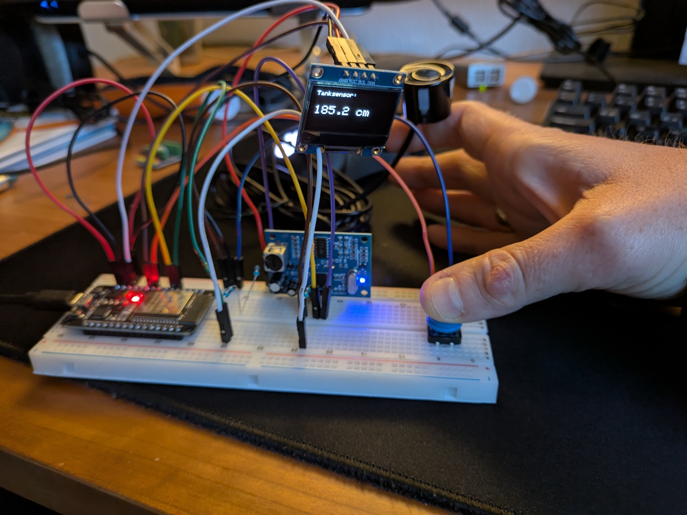
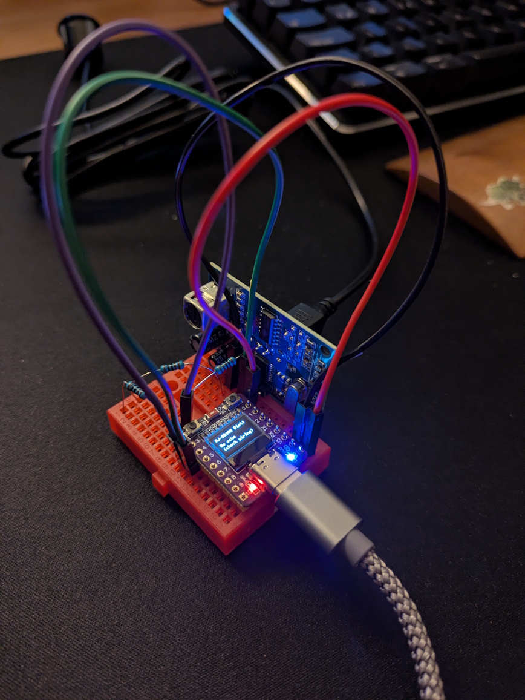
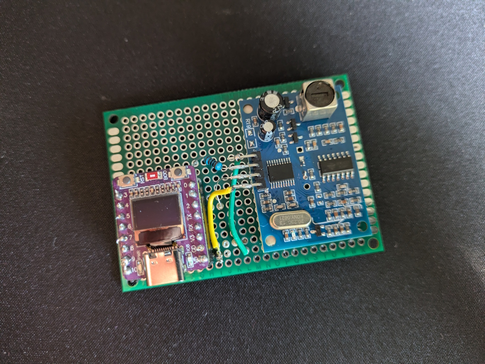
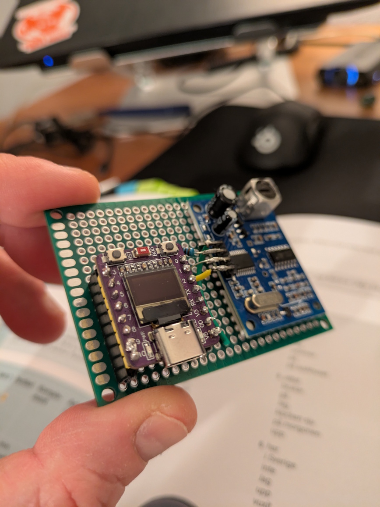
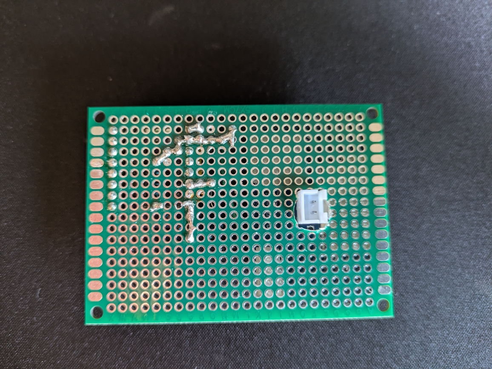
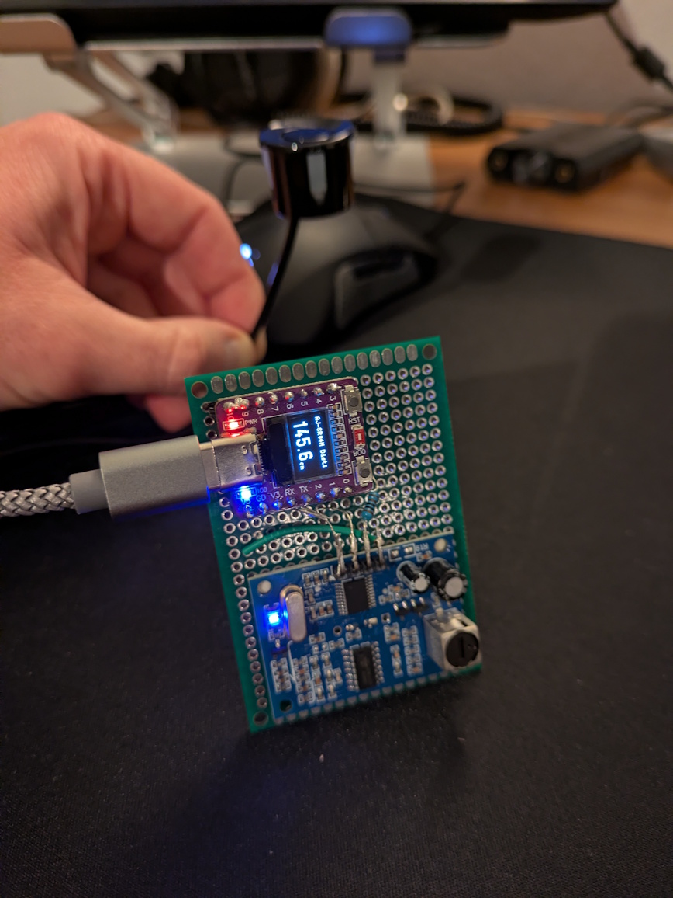

# ESP32‑C3 tank level monitor (AJ‑SR04M ultrasonic)

Small ESP32‑C3 project that measures distance with an **AJ‑SR04M ultrasonic sensor**, shows the latest reading on the built‑in 0.42″ OLED of the **ABRobot ESP32‑C3** and provides a simple web dashboard with sample history.

Intended for tank monitoring (distance to liquid surface), e.g. fresh water, greywater, and black water tanks in RVs/holiday homes.
The sensor measures **distance from the sensor to the liquid surface** (in cm). Converting this into a “fill level” (e.g. %) requires knowing the individual tank height and sensor mounting offset;
this project currently implements only robust distance measurement with logging and visualization.

## Project status / scope
This is a personal electronics + soldering project. The repository documents the implementation and the hardware setup I used.
It is not designed as a “clone → compile → run” project without adapting wiring, pins, and sensor specifics.

## Status / Features
- Distance measurement with robust filtering (median + spread/stability check)
- OLED displays the latest reading (or an error message)
- Two run modes:
  - **Periodic** (low update rate, persists measurements)
  - **Debug** (fast continuous updates, no persistence) — useful for sensor placement/alignment and quick validation.
- Persistent storage:
  - **LittleFS + CSV** log containing uptime (time since boot) and distance samples
  - Log can be cleared from the dashboard
  - Safety policy: if LittleFS free space drops below a threshold, the log is reset
- Offline web dashboard over SoftAP:
  - Shows statistics (latest/min/max etc.) + simple chart of stored samples
  - Displays basic heap/fragmentation status
  - Allows clearing the stored log

## Hardware
- ABRobot ESP32‑C3 0.42″ OLED (ESP32‑C3 DevKitM‑1)
    - see https://emalliab.wordpress.com/2025/02/12/esp32-c3-0-42-oled/
    - any ESP32 would work, but see [Wiring Bread/Perf board](#wiring-breadperf-board) for this types display specifics
- AJ‑SR04M ultrasonic sensor
  - see https://www.fabian.com.mt/viewer/42585/pdf.pdf 

### Wiring Bread/Perf board
- OLED I2C: **SDA=GPIO5**, **SCL=GPIO6** (based on boards specification)
- AJ‑SR04M/Ultrasonic: **TRIG=GPIO2 (OUT)**, **ECHO=GPIO0 (IN)** (based on the current project defaults)
  - output **5V on ECHO** but GPIOs are **3.3V max**, so use a **resistor divider** on ECHO (see `src/ultrasonic.h`).

## Measurement notes / caveats
- Ultrasonic sensors are sensitive to mounting, reflections, foam, angled surfaces, and tank geometry.
- **Blind zone / near-field limitation:** at very short distances (below ~20 cm), the AJ‑SR04M may return unstable results (timeouts or inconsistent values).
  This project mitigates that by taking multiple samples **per measurement** and rejecting noisy bursts (median + minimum valid samples + spread check),
  so too-close/garbage readings should typically result in a clear **measurement error** instead of a misleading distance.

## Run modes (double reset) and Logging behavior
Mode selection is done by a simple “double reset” toggle stored in NVS:
- First boot after reset: runs **Periodic** and arms **Debug** for next boot
- Second reset: runs **Debug** and clears the flag

- **Periodic mode**:
  - Takes a measurement every **2 hours**
  - Appends valid samples to the LittleFS CSV log (timestamp is **uptime seconds**, not wall-clock time)
- **Debug mode**:
  - Updates about every **250 ms**
  - Does **not** persist measurements (meant for quick testing / placement)

## Web dashboard (SoftAP)
On boot, the ESP32 starts a Wi‑Fi access point and serves the offline dashboard.
Default credentials:
- Wi‑Fi SSID: `TankMonitor`
- Wi‑Fi Password: `tankmonitor`
- Open: `http://192.168.4.1/`

## Build / Flash
Built with **PlatformIO** using the **Arduino framework** (Arduino-ESP32 core).

## Further Documentation
- Ultrasonic measurement/filtering notes: [`docs/ultrasonic-measurement.md`](docs/ultrasonic-measurement.md)

## Pictures

Some pictures of the project during development:

<table>
<tr>
    <td>
      <figure>
        
        <figcaption>First prototype on Breadboard with classical ESP32-D0WD</figcaption>
</figure>
    </td>
    <td>
      <figure>
        
        <figcaption>Small prototype with ESP32‑C3 and OLED on breadboard</figcaption>
</figure>
    </td>
  </tr>
  <tr>
    <td>
      <figure>
        
        <figcaption>First time soldering experience :) Prototype soldered on perfboard. AJ‑SR04M sensor board is glued.</figcaption>
      </figure>
    </td>
    <td>
      <figure>
                
      </figure>
    </td>
  </tr>
  <tr>
    <td>
      <figure>
        
        <figcaption>Back view of perfboard with plug for sensor cable</figcaption>
      </figure>
    </td>
    <td>
      <figure>
                
      </figure>
    </td>
  </tr>
</table>
